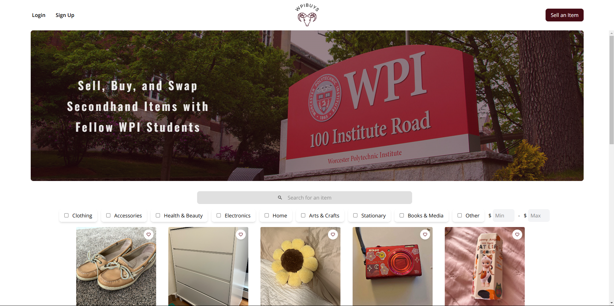

# WPI Buys
*This web application was created by Team Obsidian Ducks for the final project in CS4241 at WPI. The team includes Theresa Acheampong, Mia Frattasio, Nicholas Leslie, Colin Nguyen, and Andy Truong.*

For our final project, we created an ecommerce platform for WPI students to swap, sell, and buy second-hand items. The platform is called *WPIBuys*. All logos and icons representing WPIBuys were created by the team. Our application was designed to allow users to easily buy and sell items from other WPI students.

Website: https://wpi-buys.fly.dev/

Demo Video Link: https://www.youtube.com/watch?v=fW9sTtRRoZY&ab_channel=Swordcom36

## Technology Stack
The application was built using Next.js, TypeScript, MongoDB, and Gleam for development and Fly for deployment.
### 
Our team decided to use Next js for our front end and some portions of our back end. We picked the next js because we wanted to take advantage of server-side rendering. Server-side rendering is a technique where a backend pre-renders HTML for the client. This comes with a lot of benefits, including faster load times, smaller bundle sizes, and easier access to database content. Additionally, NextJS allows us to write simple backend functions instead of having to have a separate backend. While next js is best paired with Vercel for hosting, it also worked well with  fly.io, granted with slower load times than we would on other platforms. This is because next js is meant to run on lambda functions; however, because of design constraints mentioned in the fly.io section, we decided not to run on Vercel. Next, JS lets us use react-like in softening; however, it has extra benefits that we couldn't get with a three-tier architecture.
### 
We used Mongo DB for our database. Mongo DB is a no-SQL document database that stores all documents in a binary format called Bison. Gibson is a format for storing binary in JSON. Document databases are great for unstructured data and scalability through easier data co-location. Ultimately, our team didn't use Mongo DB to its fullest because of its unfamiliarity and use of it similar to SQL. Additionally, all of our data had a very rigid structure because every post had to have the same structure. overall, using MongoDB was a great learning experience that stretched how the team thought about databases.
### 
Our team decided to use TypeScript as our core development language because strong typing allows developers to catch errors quicker and produce better software. TypeScript is a language that compiles into Javascript, allowing for static typing to be enforced at compile time. This compile-type safety helps catch edge cases like undefined states or unexpected inputs. Most of the javascript ecosystem is moving towards typescript, so our team decided to follow the industry. Finally, our team had previous experience in typescript from Softeng.
### 
Tailwind is a CSS design system that provides easy-to-use base class primitives. Its philosophy is to combine a bunch of base classes into styles rather than create one custom-designed class. This has a couple of benefits. Firstly, it constrains the developer, enables developer tooling like LSPs, and allows developers to co-locate style structure and functionality. This co-colocation means that the styles end up being more readable and debuggable than custom CSS classes. The constraints reduce the likelihood of creating bad styles. Finally, the easy-to-use LSP allows developers to be more productive quickly. Our team picked tailwind because it let us move faster and make fully custom components faster than we would with vanilla CSS.
### 
Nick decided to write the app for the backend of our chat app in Gleam. This is for a couple of reasons. First, the chat server in TypeScript either required introducing a new build step, writing the chat server in Javascript, or setting up a fully separate server project with a monorepo to share types. All of these options came with their own drawbacks. The separate build step would slow down iteration. Writing it in JavaScript meant that we could not share code between our chat server and our web app. Finally, mono repos are often hard to navigate, configure, and maintain. This all came with the added benefit that JavaScript is not the best language for writing backend applications. While javascript is excellent at non-blocking io due to its event-driven nature, its signal threaded, ultimately bottlenecking its performance. Additionally, nodes' async nature introduces the problem of function colouring, which degrades developer experience. Also, the javascripts error handling expernce is not enjoyable becuase any async code can fail; therefore any awaited code should be wrapped in a try catch. However, due to block scoping, this results in either verbose code or a hard debugging experience. While typescript can elevate a lot of these problems by introducing static typing, allowing the developer to spot potential issues, it still just compiles down to javascript. Overall, Nick felt that if our team had to make another server anyway, we might as well try and pick a better tool for the job.
Enter Gleam and the Erlang virtual machine. Gleam is a functional language that adds algebraic typings, immutability, and pattern matching. to JavaScript and Erlang. The best way to think about it is to use a typescript with stronger type safety that also introduces a second run time. This stronger type is accomplished through algebraic typing and errors as values. Algebraic data types allow for one type to have multiple shapes. These shaps can be pattern-matched against. Pattern matching is a technique where a programmer can extract elements of a type if they know the shape of the data. Think of pattern matching as more powerful switch statements that allow you to use the data you matched against. Finally, because everything is immutable in Gleam, it removes a lot of bugs caused by data being mutated in an unexpected way. These three superpowers allow for a gleam to produce code that you know works based on type safety. Additionally, Gleam uses errors as values, forcing the programmer to deal with potentially unexpected states. However, all these niceties wouldn't be a reason to use Gleam over javascript if it wasn't for the Erlang virtual machine.
The Erlang virtual machine is a virtual machine built to run concurrent, error-resistant, and scalable software. The key to Erlang's success is its concurrency. Erlang is built with multi-core software in mind via its processes. Erlang processes are independent concurrent execution contexts that can pass messages between each other. Think of them like lightweight operating system processes. An Erlang program can run thousands of these processes all at once. These processes are powered by the schedular program, which decides which process is being run. Erlang can have one scheduler per CPU core to ensure that your programs can use the maximum available CPU. Additionally, erlang comes with developer tools for monitoring and restarting processes, allowing systems to make errors without taking down the entire system. Finally, erlang vms can facilitate cross-communication between processes, which means that Erlang clusters can treat multiple machines like one big machine. The Erlang virtual machine has been used by companies like WhatsApp and Discord to power their massive messaging systems. For all these reasons, we decided to use Gleam for our messaging system.
### 
Our team decided to use fly.io as our central deployment platform. This is because our project had features that required a full virtual cloud provider rather than an infrastructure-as-a-service platform like Glitch or Vercel. Because our project required live messaging, we had to choose if we wanted to use long polling or WebSockets. Long polling is a technique where your front end queries a backend periodically requesting data. The upsides of long polling is that it's easy to implement and does not require a stateful server. The downsides are that, in general, it requires more bandwidth, is slower, and creates a lot of unnecessary trips to the databases. The other option is WebSockets, which solves a lot of the problems with live polling by creating a persistent connection between the client and the server; however, this connection means that the server must be in a long-living and stored state. This approach is incompatible with Vervel and many other one-click hosting options. Because of these requirements, we decided to go with a full virtual cloud provider. From there, we wanted to look for a cloud that would allow us to spin up an s3 equivalent service. s3 is a storage standard made by AWS for storing large binary blobs. think about it like a massive network-connected file system. We knew that users being able to upload their own photos was core to our service; thus, we needed an s3. this left us with four real options for hosting AWS, Azure, Google Cloud, and fly.io. Our team picked fly.io for the developer experience. While fly.io is a smaller, newer cloud than the established big 3, it has made great strides to win in developer experience. Launching an app on fly.io is as easy as downloading their command line interface, setting up an account, and running fly deploy. From there, fly.io will detect your project structure, write a docker file for you, add in a Postgres database and s3 bucket if it finds you need it, and deploy on their service. All servers on fly.io will spin up on request and spin down if they find they have no users. Additionally, you only pay for what you use. This gives us flexibility and VPS ability with lambda function prices. Additionally, it allows you to quickly scale your app(even across regions), see logs, and monitor usage. Overall, fly.io is like AWS if they care about developer experience.

## Features
The key features of our application include:
1. User authentication with NextAuth
2. Item Listings
3. Search & Filtering
4. Live Messaging
5. Responsive Design

## Contributions
Team members contributions include:
1. Colin N - Multiparameter filtering, Profile Page, Co-Design home page
2. Theresa A - Schemas, Item Page, Like Feature
3. Mia F - Authorization, Login & Registration Page
4. Andy T - Sell Page, Figma Designer, Co-Design home page
5. Nick L - Live Messaging, Deployment, S3 Bucket

## Challenges
Some challenges that the team faced in completing the project include:
1. Load time issues when deploying the final application
2. Fetch errors during deployment
3. Time issues as all the components were handmade with just TailwindCSS
